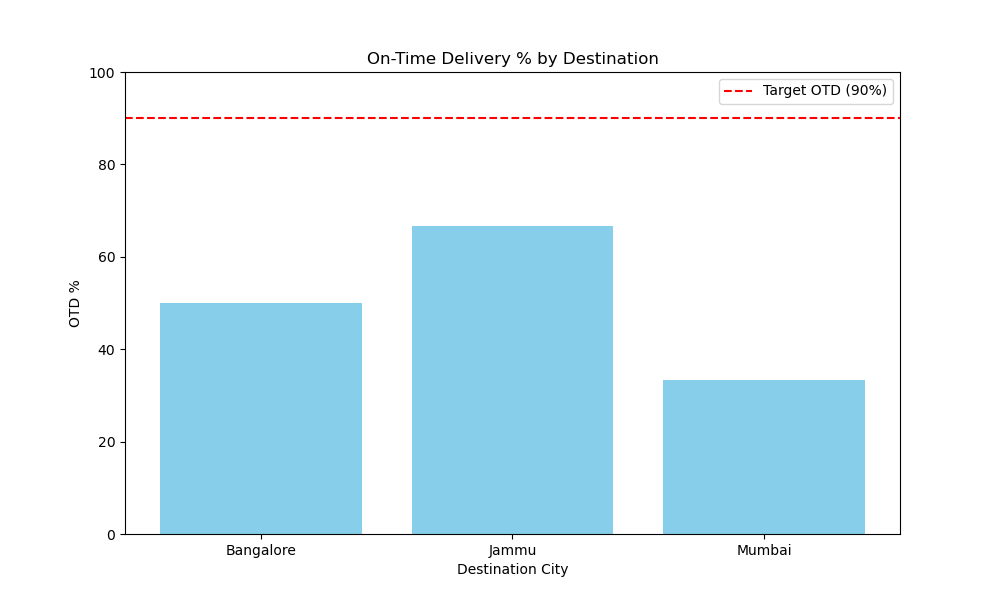

# 📦 Logistics Operations & Analytics Suite
**Technical Solutions for Supply Chain Monitoring & Network Optimization**

This repository contains a suite of automation and analytics tools designed to improve carrier accountability and streamline logistics operations.

---

## 🔍 1. Automated Shipment Exception Reporter
### *The "Software Detective" for Real-Time Monitoring*

### Overview
This tool automates the identification of delivery exceptions (delays, stuck shipments, and cancellations). It pulls real-time transit data from a MySQL backend and generates actionable Excel reports for operational teams.

### Key Features
* **Stuck Shipment Logic:** Automatically identifies packages in-transit past their expected delivery date.
* **Automated Reporting:** Generates a multi-tab Excel report with prioritized "Action Required" items.
* **Data Integration:** Bridging SQL databases with Python Pandas for seamless analysis.

### Tech Stack
* **Libraries:** Pandas, SQLAlchemy, OpenPyXL
* **Database:** MySQL
* **Script:** `reporter.py`

---

## 📊 2. Delivery Route Performance Tracker
### *The "Operational Architect" for Strategic Analysis*

### Overview
This tool analyzes historical delivery data to measure the efficiency of specific lanes (e.g., Delhi to Mumbai). It calculates Key Performance Indicators (KPIs) to identify bottlenecks and drive data-driven carrier negotiations.

### Key Features
* **OTD Analytics:** Calculates **On-Time Delivery (OTD %)** for every origin-destination pair.
* **Automated Visualization:** Generates performance bar charts comparing actual vs. target (90%) delivery rates.
* **Trend Identification:** Highlights underperforming routes that require immediate strategy shifts.

### Visual Insight

### Tech Stack
* **Libraries:** Pandas, Matplotlib, SQLAlchemy
* **Output:** CSV, PNG Charts
* **Script:** `route_analytics.py`

---

## 💰 3. Carrier Rate & Cost Optimizer
### *The "Financial Brain" for Procurement*

### Overview
A decision-support tool that integrates a relational database of carrier rate cards with live shipment data to identify the most cost-effective shipping partners for specific lanes.

### Key Features
* **Cost-Per-KG Analysis:** Automatically calculates total shipping expenditure based on carrier-specific rate cards.
* **Smart Recommendations:** Identifies the lowest-cost carrier for any given route (e.g., Delhi-Bangalore).
* **Relational Data Modeling:** Links multiple SQL tables (Shipments + Rates) to perform complex cost audits.

### Tech Stack
* **Libraries:** Pandas, SQLAlchemy
* **Database:** MySQL (Relational Schema)
* **Script:** `cost_optimizer.py`

---

## 🛠️ Setup & Installation
1. Clone the repository.
2. Install dependencies: `pip install -r requirements.txt`.
3. Configure your MySQL credentials in the script.
4. Run `reporter.py` for real-time exceptions or `route_analytics.py` for lane performance.